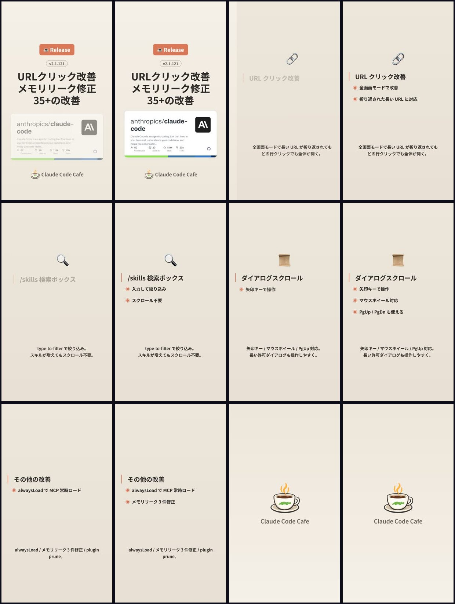

# vshot

**Video frame extraction for AI.** One montage image. One `Read()` call. Your AI can now watch videos.

<p align="center">
  
  <br>
  <em>16 frames from a 3-minute video → 1 image, 648KB</em>
</p>

## The Problem

> AI assistants can read images but can't watch videos. Feeding 20 separate screenshots burns tokens and loses context.

| Without vshot | With vshot |
|---|---|
| Manually screenshot frames | `vshot video.mp4 --montage` |
| Feed 20 images → 20,000+ tokens | Feed 1 montage → ~1,500 tokens |
| No timestamps, no context | Timestamped grid, full flow visible |
| Tedious every time | One command, done |

## How It Works

```
MP4 → ffmpeg extracts frames → timestamps burned in → ImageMagick tiles into grid → 1 image

┌──────┬──────┬──────┬──────┬──────┐
│ 0:00 │ 0:11 │ 0:22 │ 0:33 │ 0:44 │
├──────┼──────┼──────┼──────┼──────┤
│ 0:55 │ 1:06 │ 1:17 │ 1:28 │ 1:39 │
├──────┼──────┼──────┼──────┼──────┤
│ 1:50 │ 2:01 │ 2:12 │ 2:23 │ 2:34 │
└──────┴──────┴──────┴──────┴──────┘
           → montage.jpg (one image!)
```

## Modes

| Mode | Resolution | Use case |
|------|-----------|----------|
| `overview` | 480×270 | "What's in this video?" |
| `text` | 960×540 | Read UI text, code, terminals |
| `detail` | 1280×720 | Design review, pixel inspection |

## Install

### Prerequisites

```bash
brew install ffmpeg imagemagick
```

### Option A: Claude Code Plugin (Recommended)

```bash
/plugin marketplace add ClaudeCodeCafe/vshot
/plugin install vshot@vshot
```

Then use directly:

```
/watch video.mp4
/watch video.mp4 --mode text
/vshot:setup
```

### Option B: CLI Only

```bash
# Clone and link
git clone https://github.com/ClaudeCodeCafe/vshot.git
ln -s "$(pwd)/vshot/vshot" /usr/local/bin/vshot

# Or curl
curl -o /usr/local/bin/vshot https://raw.githubusercontent.com/ClaudeCodeCafe/vshot/main/vshot
chmod +x /usr/local/bin/vshot
```

## Usage

```bash
# Create montage (most common)
vshot video.mp4 --montage

# Text-readable montage
vshot video.mp4 --montage --mode text

# Just extract frames (no grid)
vshot video.mp4 --frames 20

# Every 5 seconds
vshot video.mp4 --montage --interval 5

# High detail, more frames
vshot video.mp4 --montage --mode detail --frames 30

# Clean up individual frames after montage
vshot video.mp4 --montage --cleanup
```

### Options

| Flag | Description | Default |
|------|------------|---------|
| `--montage` | Combine into single grid image | off |
| `--mode` | overview / text / detail | overview |
| `--frames N` | Number of frames | 20 |
| `--interval N` | Extract every N seconds | — |
| `--output DIR` | Custom output directory | `<video>_vshot/` |
| `--cleanup` | Remove frames after montage | off |
| `--no-timestamps` | Skip timestamp overlay | — |

## Token Efficiency

| Approach | Images to read | ~Tokens | Effort |
|----------|---------------|---------|--------|
| Manual screenshots | 5-10 | 5,000-10,000 | High |
| Frame dump | 20 | 20,000+ | Medium |
| **vshot montage** | **1** | **~1,500** | **One command** |

## Dependencies

| Dependency | Install | Required for |
|---|---|---|
| ffmpeg | `brew install ffmpeg` | Frame extraction (always) |
| ImageMagick | `brew install imagemagick` | Montage grid (`--montage` only) |

## License

MIT
